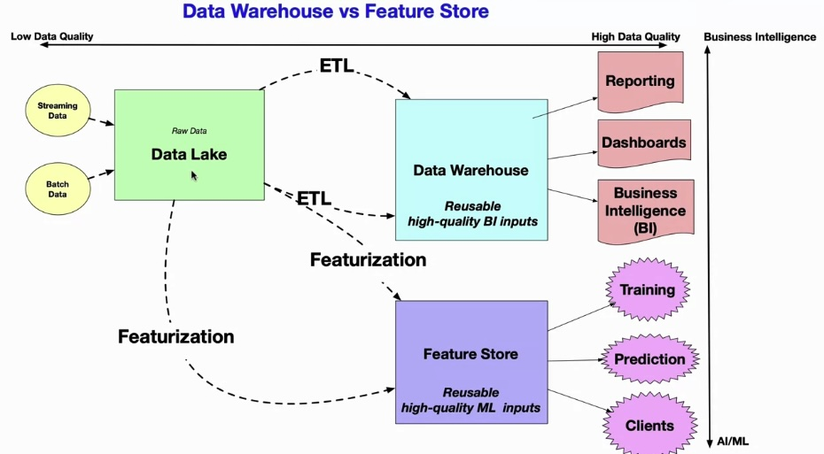

# 1. Introduction to MLOps

We'll cover

* What is MLOps
* Key Concepts in MLOps
* Key Concepts in Microservices

## 1.1 What is MLOps

### Key Terms

* **MLOps:** Combination of DevOps-style automation methods and ML best practices for deployment and operation.
* **DevOps:** Culture of collaboration and automation (following principles like CI/CD) of developer operations to continuously improve deployment.
* **CI/CD:** Continuous integration and continuous delivery - CI involves regular automated resting and validating, and CD focuses on automatically releasing updates to environments like prod.
* **Maturity Model:** Concept in MLOps defining ascending levels of MLOps sophistication and effectiveness, from manual, siloed, unreliable to scalable, autonomous and resilient systems.
* **Data Ops:** Specific focus on use of DevOps to manage data workloads; such as aggregation, transformation, storage, analysis, ...
* **Feature Store:** Central repository to manage, store, and serve ML features for model building and training.


At the heart of MLOps is the concept of continuous improvement.

It burrows a lot from DevOps, DataOps, and framing the system for business requirements. Therefore, an MLOps engineer should have a knowledge in all these areas.


#### What is DevOps

A loop between the following components:

* SWE best practices
* Culture of the organization
* Automation (CI/CD)

#### MLOps Hierarchy of Needs

DevOps $\rightarrow$ DataOps $\rightarrow$ Platform Automation $\rightarrow$ MLOps

* DevOps:
  * Continuous delivery + build systems
* DataOps:
  * Data management platforms (AWS Athena)
  * Data Jobs (Airflow)
  * Serverless query and visualization

* Platform Automation
  * Feature stores
  * Model serving
  * Experiment tracking
  * Data drift detection
* MLOps
  * Business ROI
  * Problem framing
  * Forecasting + predictions + pattern discovery

#### Data Poisoning

Cybersecurity existential insider threat via "data poisoning". What people inside an org can do; that's why **principles of least privilege** is important.

* "_Put a prohibited data in the Corp Google Drive_"
* "_Secretly seed training data that will trigger the classification system and make it return Forbidden Content for users_"


## 1.2 Key Concepts in MLOps

### Key Terms

* **MLOps Platform:** A specialized software solution and workflow for operationalizing machine learning models. It provides <u>_data labeling_</u>, <u>_model monitoring_</u>, <u>_feature stores_</u>, and <u>_optimized model serving_</u>.
* **Continuous Integration (CI):** An automated software development practice where developers frequently merge code changes into a shared repo. Changes are then automatically built and tested.
* **Continuous Delivery (CD):** A SWE approach where teams produce software in short cycles, ensuring it can be reliably released at any time.
* **Infrastructure as Code:** Managing and provisioning infra through code instead of manual process.
* **Feature Store:** A centralized repository that stores curated features for ML model training.


#### Levels of MLOps Maturity

| Level |                                 | What it does                                                 |
| ----- | ------------------------------- | ------------------------------------------------------------ |
| 0     | No MLOps                        | * Difficult to manage full ML model lifecycle<br />* The teams are disparate and releases are painful<br />* Most systems exist as "black boxes", little feedback during/post deployment |
| 1     | DevOps but no MLOps             | * Releases are less painfull, but rely on Data Team for every new model<br />* Still limited feedback on how well a model performs in prod<br />* Difficult to trace/reproduce results |
| 2     | Automated training              | * Training environment is fully managed and traceable<br />* Easy to reproduce model<br />* Releases are manual, but low friction |
| 3     | Automated model deployment      | * Releases are low friction and automatic<br />* Full traceability from deployment back to original data<br />* Entire environment managed.   train > test > prod |
| 4     | Full MLOps automated operations | * Full system automated and easily monitored<br />* Production systems are providing information on how to improve and, in some cases, automatically improve with new models<br />* Approaching a zero-down system |

They key factor here is *automation*.


### What is Continuous Integration

Let's walk through an example on how to have CI in a cloud-based workspace.

#### Cloud-based workspaces

It's recommended that we use a cloud-based workspace. That is because it usually does the heavy lifting for us for setting up the development environment. More and more developers are turning to cloud-based workspaces; such as:

* AWS
* Github Workspaces
* ...

---


##### Github Workspaces - Virtual Environment

In your github repo you can initiate a **GitHub workspaces**. It will open a VSCode for you. You have access to terminal and you can create a venv, install packages, do your implementations, ... It's pretty nice!

It's a good idea to have one workspace for each repo. So, let's set it up in a way that the terminal is preserved for all your sessions. In the terminal

* Create a virtual environment `venv`

* `vim ~/.bashr` and add the following:

```bash
# Source Virtual Environment
source ~/.venv/bin/activate
```

* Now, if you open a new terminal, you're still in the `venv`

##### Github Workspaces - Scaffolding

We need the following files:

* `requirements.txt`: the list of Python dependencies for our project

  ```bash
  $ touch requirements.txt
  
  black==21.9
  pylint
  pytest==6.2.5
  pycov
  ```

* `Makefile`: it's like a cookbook on how to build the project

  ```bash
  $ touch Makefile
  ```

  ```bash
  # Makefile
  install:
  			pip install --upgrade pip && pip install -r requirements.txt
  			
  test:
  			python -m pytest -vv --cov=hello test_hello.py
  			
  format:
  			black *.py
  			
  lint:
  			pylint --disable=R,C hello.py
  			
  all: install lint test
  ```

* Now that we have `Makefile`, we can do the following:

  ```bash
  $ make install # chooses the install option
  $ make test    # Runs the tests by pytest
  $ make format
  $ make lint    # Syntax errors and warnings
  $ make all     # Does everything in the order specified in the Makefile
  ```

##### Github Actions - Build System


Sets up a build system based on the workflow you want. It creates a folder `repo/.github/workflows/` where you put a `.yaml` file, like `main-ci.yaml`

```yaml
name: Description about the repo and the actions

on: [push]

jobs:
	build:
		runs-on: ubuntu-latest
		steps:
			- uses: actions/checkout@v2
			- name: Set up Python 3.11
				uses:	actions/setup-python@v1
				with:
					python-version: 3.11
			- name: Install dependencies
				run: |
						make install
			- name: Lint with pylint
				run: |
						make lint
			- name: Test with pytest
				run: |
						make test
			- name: Format code
				run: |
						make format
```


### What is a Feature Store?




### What is a Data Drift?

If the data is constantly changing, you do not have the information you think you have.


## 1.3 Microservices

### Key Terms

* **Microservice:** Encapsulated, reusable logic that is deployed into prod.
* **End-to-End MLOps:** Fully automating the ML lifecycle from model development through deploymet and hosting via platforms like Hugging Face Spaces.
* **AWS App Runner:** A fully managed service for deploying containerized web services and APIs.
* **Flask:** A popular, lightweight Python web application framework.
* **Makefile:** A file containing a set of directives used to automate building and managing a project.
* **requirements.txt:** A file containing a list of Python package dependencies used by th application.


#### Operationalizing a Microservice

You can think about a microservice as the **logic that goes live**. It could be

* Small, reusable code
* Command-line tool
* Library
* Microservice service
* Container

With **Continuous Delivery (CD)** you can create *any number of* environments; e.g., _staging_, _prod_, ... . Within _staging_ environment, you can check different metrics (health, CPU, memory, ...) to make sure your application is working as intended. Once confirmed, you can graduate it into *prod*.


#### CI for Microservices

Let's see how you can set up a CI ecosystem for microservices. That is how we can (1) test, (2) lint, (3) format the code any time a contributor pushes a code to a git repository.

* **yaml** file
  * See the above example on how to have a `.yaml` file inside `<REPO>/.github/workflows` and what to put in the there
  * e.g., `mlops_repo/.github/workflows/main.yaml`

* **requirements.txt**
  * See the above example for `<REPO>/requirements.txt` and how to put dependencies there.
* **Makefile**
  * See the above example to see how to have this _recipe_ file in `<REPO>/Makefile`

Once you have these files set up, every time you push a code, Github automatically follows the recipe (in `Makefile`) to build, test, lint, and ... .


#### End-to-end MLOps Hugging Face Spaces ⭐️⭐️⭐️

This is how Hugging Face MLOps workflow looks like:

* Create an account on [Hugging Face](https://huggingface.co)
* Create a space (e.g., `prompt-based-summarization-v01`)
* Create a Github repository (e.g., `prompt-based-summarization`)
* Go to this Github repo and choose Code > Workspaces
  * Create a Workspace
* Setup the virtual environment
  * In the workspace, create a **virtualenv**
  * Add `source .venv/bin/activate` to **~/.bashrc** so this virtualenv is loaded everytime
  * Add **requirments.txt** and specify the dependencies
* Set up **CI**
  * Add a **Makefile** with instructions for **build**, **test**, **lint**, **format**, etc
* Set up **CD**
  * Create a **Token** on your profile in Hugging Face.
  * Add that _Token_ to your Github repo's **secrets**
  * Setup an **Action** (`main.yaml`) such that it syncs the code with Hugging Face's Space, every time you push a new code to the main branch.
* Check the outcome on Hugging Face Space!


#### AWS App Runner ⭐️⭐️⭐️

Let's say we have an app that we built using **FastAPI** and we want to deploy our microservice to **AWS Cloud9**.

```python
# <REPO>/microservice/main.py
from fastapi import FastAPI
import uvicorn

app = FastAPI()

@app.get("/")
async def root():
  return {"message": "Hello from my api"}

@app.get("/add/{num1}/{num2}")
async def add(num1: int, num2: int):
  return {"total": num1 + num2}

if __name__ == "__main__":
  uvicorn.run(app, port=8080, host="0.0.0.0")
```


* In Github, setup your Workspace as AWS Cloud9
  * It has all the necessary files
    * `.venv` virtualenv
    * Makefile
    * requirements.txt
    * Action `main.yaml` for CI
* We use **AWS App Runner**
  * Source: `Source code repository`
    * It connects to Github to pull the repo
  * Deploy settings:
    * Automatic: Continuous Delivery on every push
    * Manual: one-time load
  * Configure build
    * Runtime: Python3
    * Build command: `pip install -r requirements.txt`
    * Start command: `python main.py`
  * Configure service:
    * Service name: `My Microservice`
  * Create and deploy
  * Now, you'll see your app running in the **App Runner**
* Your app is now running on some URL assigned to your app.

(Same thing when using **Flask** instead of **FastAPI**)


#### Get Started with Makefile

The `make` command is usually installed on all _unix_-based OS. In your repo, you create a `Makefile` and define your commands:

```makefile
hello:
	echo "Hello World!"
	
install:
	echo "Replace this with an actual install command"
```

Once you've defined your commands in the `Makefile`, the rest is basically `make <command>`.


### Three Most Important Files In Your Project

* Makefile

  * Automate installation, lint, test, ... steps.

* Dockerfile

  * It attaches the runtime packages.

    ```dockerfile
    FROM public.ecr.aws/lambda/python:3.11
    
    RUN mkdir -p /app
    COPY . main.py /app/
    WORKDIR /app
    RUN pip install -r requirements.txt
    EXPOSE 8080
    CMD [ "main.py" ]
    ENTRYPOINT [ "python" ]
    ```

    ```bash
    $ docker build .
    $ docker run -p 127.0.0.1:8080:8080 54a55841624f
    ```

* requirements.txt

  * Python package requirements.

